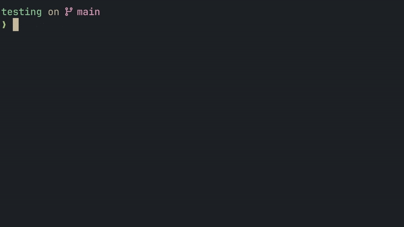
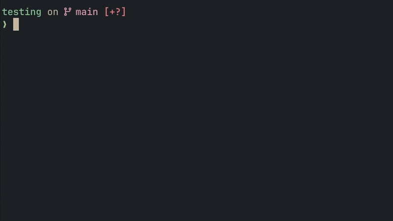

# snap

> Snap your commits into shape.

`snap` is a lightweight CLI tool that helps you create consistent Git commits following the [**Conventional Commits**](https://www.conventionalcommits.org/en/v1.0.0/) standard.


---

## Features

- **Interactive commit flow** - Select type, enter scope, write summary - all via keyboard-friendly prompts
- **Conventional Commits** - Enforces `<type>(<scope>): <summary>` format automatically
- **Built-in validation** - Rejects invalid types, warns if summary/scope is too long
- **Auto-stage** - `-a` flag stages all tracked files before committing
- **Amend support** - `--amend` to edit the latest commit message
- **Zero config** - Works out of the box with sensible defaults
- **Custom config** - Create `.snap.toml` to customize commit types and validation rules

---

## Installation

### Option 1: Go

Install with Go 1.21+

```bash
go install github.com/nxkh4ng/snap@latest
```

> [!IMPORTANT]
> Make sure your `$GOPATH/bin` (or `%USERPROFILE%\go\bin` on Windows) is in your `PATH`

### Option 2: Download binary

1. Download the ZIP file for your OS from:
   - [Github Releases](https://github.com/nxkh4ng/snap/releases)
   - [Codeberg Releases](https://codeberg.org/nxkh4ng/snap/releases)
2. Extract the archive
3. Move `snap` (or `snap.exe` on Windows) to a folder in your `PATH`

---

## Quick Start

### Auto-stage

```bash
snap -a
```

Stages all tracked files automatically before committing.


### Amend commit

```bash
snap --amend
```

Edit the latest commit message.



### Add **Breaking Change** commit

Add `!` at the end of type name



---

## Commands

| Commands         | Description                                |
| ---------------- | ------------------------------------------ |
| `snap`           | Create a new commit                        |
| `snap -a`        | Auto-stage tracked files and create commit |
| `snap --amend`   | Amend the latest commit message            |
| `snap init`      | Create `.snap.toml` config file            |
| `snap --help`    | Show help                                  |
| `snap --version` | Show version                               |

---

## Configuration

### Initialize config

```bash
snap init
```

Creates `.snap.toml` in the current directory.

### Default config

```toml
# Commit types available in the interactive selector
[commit_types]
feat = "A new feature"
fix = "A bug fix"
docs = "Documentation only changes"
style = "Formatting, white-space, missing semi-colons"
refactor = "Code changes that neither fix bugs nor add features"
perf = "Code changes that improve performance"
test = "Adding missing tests or correcting existing tests"
build = "Changes that affect the build system or external dependencies"
ci = "Changes to our CI configuration files and scripts"
chore = "Other changes that don't modify src or test files"
revert = "Reverts a previous commit"

# Validation rules
[validations]
summary_max_length = 60
scope_max_length = 30
require_scope = false
require_description = false
```

### Config options

| Option                | Type | Default  | Description                |
| --------------------- | ---- | -------- | -------------------------- |
| `commit_types`        | map  | 11 types | Commit types               |
| `summary_max_length`  | int  | 60       | Max characters for summary |
| `scope_max_length`    | int  | 30       | Max characters for scope   |
| `require_scope`       | bool | false    | Make scope mandatory       |
| `require_description` | bool | false    | Make description mandatory |

---

## Uninstall

```bash
# macOS / Linux
rm "$(go env GOPATH)/bin/snap"

# Windows (PowerShell)
Remove-Item "$(go env GOPATH)\bin\snap.exe"

# Windows (CMD)
del "%USERPROFILE%\go\bin\snap.exe"
```
